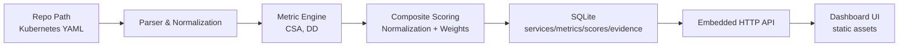

# Study Project - Phase 2 Document
(Design & Proof of Concept)

## Cover Page

- Course Title: Operational Complexity Meter (OCM): Quantifying Operational Complexity in Distributed Systems
- Project Title: Operational Complexity Meter (OCM) - MVP/POC
- Student Name(s): Aabid Ali Sofi
- Student ID(s): 2023EBCS041
- Project Advisor / Supervisor: Preethy P Johny
- Date of Submission: Feb 12, 2026

---

## 1. Introduction

### 1.1 Purpose of Phase 2

Phase 2 translates the Phase 1 idea (quantifying operational complexity in distributed systems) into an implementable system design and a working proof of concept.

This phase focuses on:

- Converting the problem definition into a concrete architecture and requirements.
- Defining the MVP scope and module boundaries for the prototype system.
- Validating feasibility by implementing an end-to-end PoC that computes and explains at least one operational complexity metric.

### 1.2 Scope of Phase 2

Included:

- System architecture aligned to the pipeline described in `specs/00-overview.md`.
- Functional and non-functional requirements for the MVP.
- Database schema and data flow design.
- A working PoC implementation (single-binary Go app) that:
  - parses Kubernetes YAML
  - computes metrics
  - stores results in SQLite
  - serves a local web UI and JSON API
  - supports evidence drill-down for the CSA metric

Excluded (prototype scope):

- Production-scale ingestion and long-running scheduled execution.
- Authentication/authorization and multi-user access.
- Advanced data sources (Helm rendering, Dockerfile parsing, Git-based volatility) beyond what is implemented in the PoC.

---

## 2. System Overview

### 2.1 Product Perspective

OCM is a standalone prototype tool used by engineers to analyze a repository/workspace containing deployment artifacts (Kubernetes YAML, and later Helm/Docker/Git signals).

In the PoC implementation, OCM is shipped as a single executable that:

- Runs locally against a repo path (`--repo`).
- Persists results into a local SQLite DB (`--db`).
- Serves a local dashboard and API over HTTP.

Deployment environment:

- Local development machine (desktop/laptop).
- Local HTTP server (intended for localhost use).

### 2.2 Major System Functions

Major system functions in the MVP/POC:

- Discover Kubernetes YAML manifests under a repository path.
- Identify services deterministically.
- Parse and normalize config facts.
- Compute MVP metrics:
  - CSA (Configuration Surface Area)
  - DD (Dependency Depth)
- Normalize metrics and compute a composite OCM score.
- Persist services, metrics, composite scores, and metric evidence into SQLite.
- Provide a dashboard to:
  - display repo-level aggregates
  - display per-service latest values
  - show evidence for CSA on click

### 2.3 User Classes and Characteristics

- Engineers / SRE / DevOps: primary users, run OCM locally for insight into operational complexity.
- Architects / Tech Leads: compare services and identify risk drivers.
- External Systems: not applicable for PoC (no external auth, no integrations).

---

## 3. Functional Requirements

FR1: The system shall accept a local repository/workspace path as input.

FR2: The system shall discover Kubernetes manifests (`.yml` / `.yaml`) under the input path.

FR3: The system shall deterministically map discovered artifacts to a stable service identity.

FR4: The system shall parse Kubernetes YAML and extract configuration facts required to compute CSA.

FR5: The system shall compute CSA per service for a given analysis run.

FR6: The system shall compute DD per service from an extracted dependency graph, with deterministic behavior in the presence of cycles.

FR7: The system shall normalize metric values across a defined cohort and compute a composite OCM score.

FR8: The system shall persist services, metric values, composite scores, and metric evidence into a SQLite database.

FR9: The system shall expose a local HTTP API for reading:

- services
- metric time series
- composite score time series
- repo-level aggregates
- metric evidence for the latest run

FR10: The system shall serve a local dashboard that displays:

- repo CSA aggregate and repo OCM aggregate
- per-service latest CSA and OCM
- evidence drill-down for CSA

---

## 4. Non-Functional Requirements

### 4.1 Performance Requirements

- The PoC should complete analysis on small-to-medium repos (tens to hundreds of YAML files) within a reasonable interactive time (seconds to a few minutes depending on machine).
- Dashboard and API calls should be responsive (sub-second for typical DB sizes in PoC).

### 4.2 Security Requirements

- PoC assumes localhost-only usage. No authentication is implemented.
- If exposed beyond local development, authentication/authorization must be added (per `specs/60-api-backend.md`).

### 4.3 Usability Requirements

- Dashboard must provide readable metric labels and a clear empty/error state.
- Evidence drill-down must show enough traceability to justify metric values (source file path + manifest context).

### 4.4 Scalability and Maintainability

- Modular design: parsing, pipeline, storage, API, and dashboard are separate packages.
- Metrics should be extensible to additional dimensions (DB/CV/FE/CDR) in future phases.

---

## 5. System Architecture and Design

### 5.1 System Architecture Diagram

High-level architecture (MVP/POC):



Brief explanation:

- The CLI triggers analysis on startup.
- The pipeline computes metric values and attaches evidence.
- Results are persisted into SQLite for querying.
- The embedded HTTP server serves an API and a static dashboard.

### 5.2 Module-wise Design

Implementation references are based on the current PoC code:

- CLI + Server (`cmd/ocm/main.go`)
  - Runs the analysis pipeline once on startup
  - Migrates the DB schema
  - Saves the run results
  - Starts HTTP server for `/api/*` + `/` dashboard

- Parser & Normalization (`internal/parser/yamlscan.go`)
  - Inputs: Kubernetes YAML documents
  - Outputs: per-document facts for CSA, inferred dependencies, evidence items
  - Evidence includes: component type (env/port/resource/replica/spec_key), key/value, source file path, manifest kind/name

- Pipeline (`internal/pipeline/pipeline.go`)
  - Discovers YAML files
  - Service identification strategies:
    - `dir` (default): service name = first directory segment under `--repo`
    - `manifest`: service name from `metadata.name`
  - Aggregates parsed facts per service
  - Computes metrics (CSA, DD)
  - Normalizes and computes composite OCM score

- Metric Engine
  - CSA: computed as a count of extracted configuration facts
  - DD: computed as longest path length in the SCC-condensed DAG (cycles handled deterministically)

- Storage (SQLite) (`internal/storage/storage.go`)
  - Migrates schema
  - Saves per-run metrics, scores, and evidence
  - Serves query methods for API

- Embedded API (`internal/api/api.go`)
  - Provides health, service listing, metric and score series, overview aggregates, and evidence endpoints

- Dashboard (`internal/dashboard/`)
  - Static HTML/CSS/JS assets embedded into the Go binary
  - Provides per-service selection and metric drill-down modal

### 5.3 Data Flow Design

End-to-end data flow in the PoC:

1) Input selection
   - User runs the CLI with `--repo` and `--db`.

2) Discovery
   - Walk the repo filesystem and collect `.yml`/`.yaml` files.

3) Parsing and fact extraction
   - Decode YAML documents
   - Extract CSA contributors and store them as evidence
   - Extract inferred dependencies (best-effort heuristics)

4) Metric computation
   - CSA is aggregated per service
   - DD is computed from the inferred dependency graph

5) Normalization and composite
   - Cohort: all services in the current run
   - Normalization: `(M - min) / (max - min)`; if `max == min`, normalized value is `0`
   - Composite score: MVP uses CSA and DD only (default weights 0.5/0.5)

6) Persistence
   - Insert/ensure service rows
   - Insert metric rows
   - Insert composite score row
   - Insert metric evidence rows

7) Presentation
   - UI loads `/api/overview` and `/api/services`
   - UI loads per-service metric series and score series
   - UI loads metric evidence on click

### 5.4 Database Design

The PoC implements the Phase-2 schema in `specs/50-persistence-sqlite.md` and extends it with a metric evidence table.

Core tables:

```sql
services(
  id INTEGER PRIMARY KEY,
  name TEXT,
  repository TEXT
)

metrics(
  id INTEGER PRIMARY KEY,
  service_id INTEGER,
  metric_type TEXT,
  metric_value REAL,
  timestamp TEXT
)

composite_scores(
  id INTEGER PRIMARY KEY,
  service_id INTEGER,
  ocm_score REAL,
  timestamp TEXT
)
```

Evidence table (PoC extension):

```sql
metric_evidence(
  id INTEGER PRIMARY KEY,
  service_id INTEGER,
  metric_type TEXT,
  component TEXT,
  evidence_key TEXT,
  evidence_value TEXT,
  source_path TEXT,
  manifest_kind TEXT,
  manifest_name TEXT,
  timestamp TEXT
)
```

Rationale for evidence storage:

- CSA is a count; the evidence list makes CSA explainable and debuggable.
- Each run stores evidence with the same run timestamp.

---

## 6. Technology Stack and Justification

- Backend/CLI: Go
  - Single-binary distribution and a simple local deployment story.
  - Good fit for embedded HTTP server and fast file scanning.

- Database: SQLite (embedded)
  - Zero configuration and deterministic storage.
  - Easy to query for dashboard needs.

- Parsing: `gopkg.in/yaml.v3`
  - Reliable YAML decoding for Kubernetes manifests.

- UI: Static HTML/CSS/JS
  - Served directly by the embedded server.
  - No runtime frontend build chain required.

---

## 7. Proof of Concept (PoC)

### 7.1 PoC Description

The PoC validates that OCM can:

- Ingest real-world Kubernetes YAML.
- Compute a meaningful operational complexity proxy (CSA).
- Persist results and expose them through a dashboard and API.
- Provide "explainability" of metric values through evidence drill-down.

PoC implementation entrypoints:

- Run: `just run REPO=/path DB=ocm.sqlite PORT=8080`
- Dashboard: `http://127.0.0.1:8080/`

### 7.2 PoC Demonstration Details

Demonstrated features:

- Repo-level aggregates:
  - Repo CSA (latest sum)
  - Repo OCM (latest avg)
- Per-service latest CSA and OCM
- Evidence drill-down for CSA (click CSA tile)
- API endpoints:
  - `GET /api/healthz`
  - `GET /api/overview`
  - `GET /api/services`
  - `GET /api/services/{id}/metrics/CSA`
  - `GET /api/services/{id}/metrics/CSA/evidence`
  - `GET /api/services/{id}/scores`

Current limitations:

- CSA extraction is heuristic and intentionally simplified.
- Dependency extraction is heuristic; DD correctness depends on naming conventions.
- Helm chart rendering and Git-based volatility are not implemented in the PoC.
- Pipeline runs on startup only (no "re-run" button in UI).

---

## 8. Testing and Validation Strategy

- Unit tests
  - Longest-path/DD behavior with cycles is validated with SCC condensation tests.
  - Normalization edge case (`max == min`) is validated.
  - See: `internal/pipeline/pipeline_test.go`

- Manual testing
  - Run the tool against a repository such as `argoproj/argocd-example-apps`.
  - Verify:
    - services are discovered
    - CSA values change when YAML config changes
    - evidence list reflects the underlying YAML facts

---

## 9. Risks, Challenges, and Mitigation

Identified risks:

- R1: Service identification ambiguity (repo structures vary)
  - Mitigation: provide multiple strategies (`--service-key dir|manifest`) and document behavior.

- R2: Dependency extraction uncertainty (DD requires consistent evidence)
  - Mitigation: implement deterministic cycle handling; document current heuristics; plan future extraction via ingress/service refs.

- R3: Metric validity vs. heuristic implementation
  - Mitigation: keep PoC transparent by storing evidence; iterate on extraction rules with real datasets.

- R4: Scope creep (many metrics and data sources)
  - Mitigation: enforce MVP focus (CSA/DD) and add metrics incrementally.

---

## 10. Phase 2 Outcomes and Readiness for Phase 3

Phase 2 outcomes:

- A concrete system design aligned to the architecture described in `specs/`.
- A working end-to-end PoC:
  - ingestion (Kubernetes YAML)
  - metric computation (CSA, DD)
  - scoring (composite OCM)
  - persistence (SQLite)
  - visualization + API
  - evidence drill-down for CSA

Readiness for Phase 3:

- The codebase provides a modular foundation to add:
  - improved parsing rules
  - additional data sources (Helm, Git)
  - additional metrics (CV/FE/CDR)
  - richer UI views

---

## 11. Supervisor Review and Approval

- Advisor Feedback:
- Supervisor Comments:
- Recommendations:
- Signature: ___________________________
- Date: _______________________________
